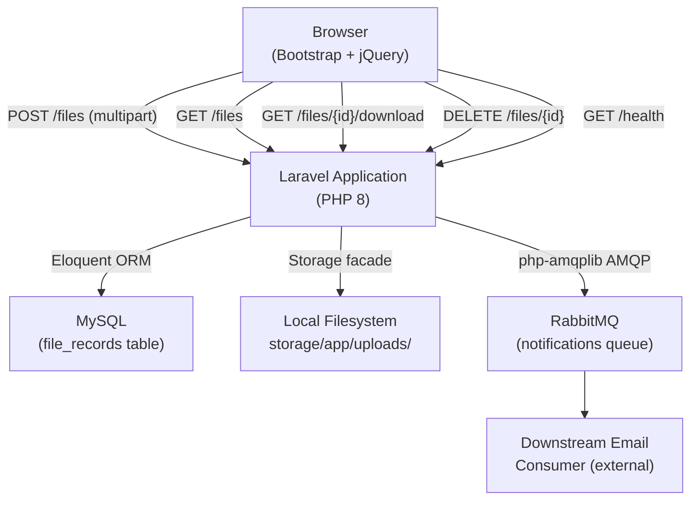
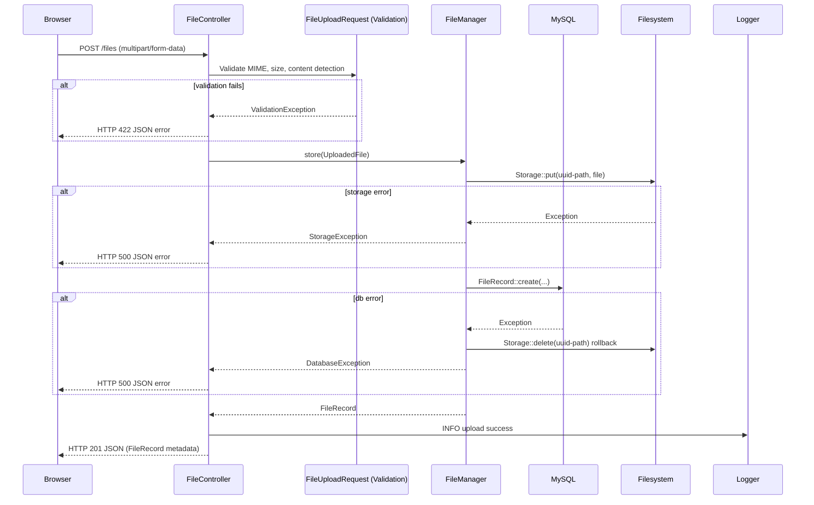
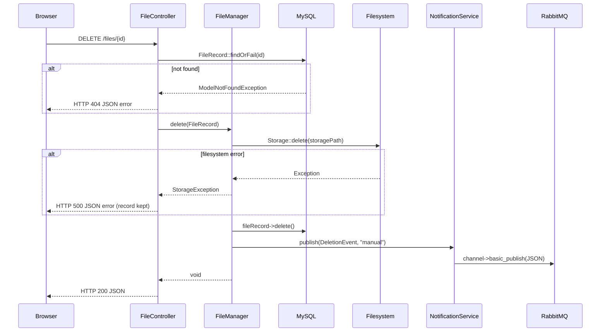
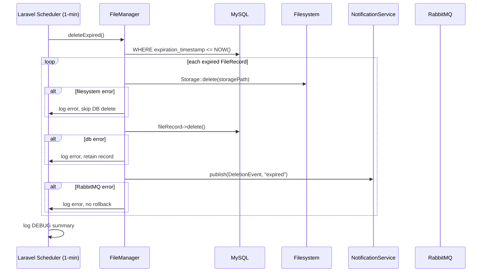

# Design Document: PDF/DOCX File Storage Service

## Overview

This document describes the technical design for a Laravel-based web application that lets users upload, list, and manually delete PDF and DOCX files. Files are subject to a configurable retention window (default 24 hours); once a file expires the system automatically removes it from both the filesystem and the database, then publishes a deletion-event message to a RabbitMQ queue so a downstream consumer can send an email notification. Manual deletions trigger the same notification flow.

### Key Design Goals

- **Atomicity of file + record lifecycle**: the filesystem and database row are always kept in sync; a file is never left orphaned and a record is never left pointing at a missing file.
- **Loose coupling for notifications**: the application never sends email directly; it publishes a JSON envelope to RabbitMQ and lets a downstream service handle delivery.
- **Single source of truth for configuration**: every tunable parameter is surfaced through `config/filestorage.php`, which reads from `.env`.
- **Security by default**: UUID-based storage paths, content-level MIME validation, rate limiting, CSRF enforcement, and hardened HTTP headers are applied from day one.

---

## Architecture

### High-Level Component Diagram



### Request / Response Flow — Upload



### Request / Response Flow — Manual Delete



### Scheduler Flow — Auto-Expiry



---

## Components and Interfaces

### Controllers

#### `FileController`

Handles all HTTP endpoints. Thin controller — delegates work to `FileManager` and `NotificationService`.

```php
class FileController extends Controller
{
    public function __construct(
        private FileManager $fileManager,
        private NotificationService $notificationService,
    ) {}
    // ...
}
```

#### `HealthController`

Handles the `GET /health` endpoint. Checks DB and RabbitMQ connectivity independently.

```php
class HealthController extends Controller
{
    /**
     * GET /health
     * Checks database (SELECT 1) and RabbitMQ (AMQP connect attempt).
     * Returns HTTP 200 {"status":"ok",...} or HTTP 503 {"status":"degraded",...}.
     */
    public function __invoke(): JsonResponse {}
}
```

```php
class FileController extends Controller
{
    public function __construct(
        private FileManager $fileManager,
        private NotificationService $notificationService,
    ) {}

    /**
     * GET /files
     * Renders the CRUD page with all FileRecords ordered by upload_timestamp DESC, paginated.
     */
    public function index(): View|Response {}

    /**
     * POST /files
     * Accepts FileUploadRequest, stores file, returns 201 JSON with FileRecord metadata.
     */
    public function store(FileUploadRequest $request): JsonResponse {}

    /**
     * GET /files/{fileRecord}/download
     * Streams the stored file to the browser using Storage::download().
     * Returns 200 with Content-Disposition: attachment on success.
     * Returns 404 if FileRecord or physical file not found.
     */
    public function download(FileRecord $fileRecord): StreamedResponse|JsonResponse {}

    /**
     * DELETE /files/{fileRecord}
     * Deletes the file and record; publishes deletion event.
     * Returns 200 on success, 404 if not found, 500 on storage error.
     */
    public function destroy(FileRecord $fileRecord): JsonResponse {}
}
```

### Form Requests

#### `FileUploadRequest`

Centralises all upload validation rules and messages.

```php
class FileUploadRequest extends FormRequest
{
    /**
     * Returns validation rules driven by App_Config.
     * Rules:
     *   'file' => required|file|max:{maxKb}|mimes:pdf,docx
     */
    public function rules(): array {}

    /**
     * Custom messages for 422 responses.
     */
    public function messages(): array {}
}
```

### Services

#### `FileManager`

The core domain service. All filesystem and database mutations go through this class.

```php
class FileManager
{
    public function __construct(
        private NotificationService $notificationService,
    ) {}

    /**
     * Stores the uploaded file and creates a FileRecord.
     * Throws StorageException on filesystem failure.
     * Throws DatabaseException on record creation failure (also rolls back filesystem write).
     *
     * @throws StorageException
     * @throws \RuntimeException
     */
    public function store(UploadedFile $file): FileRecord {}

    /**
     * Deletes file from filesystem, then removes the FileRecord from DB.
     * Throws StorageException if filesystem delete fails (record is NOT removed).
     *
     * @throws StorageException
     */
    public function delete(FileRecord $fileRecord): void {}

    /**
     * Finds all expired FileRecords and deletes each one.
     * Per-record errors are logged but do not abort the batch.
     * Returns a summary array: ['found' => int, 'deleted' => int, 'failed' => int].
     */
    public function deleteExpired(): array {}

    /**
     * Generates the internal storage path for a new file.
     * Format: uploads/{uuid}.{ext}
     */
    private function buildStoragePath(UploadedFile $file): string {}

    /**
     * Sanitizes the original filename before persisting to DB.
     * Strips path separators, control characters, null bytes.
     */
    private function sanitizeFilename(string $name): string {}

    /**
     * Verifies the file's binary content MIME using finfo.
     * Returns the detected MIME string.
     */
    private function detectMime(UploadedFile $file): string {}
}
```

#### `NotificationService`

Wraps `php-amqplib` and publishes JSON deletion-event messages. Connection is lazy — opened on first publish and reused within a single request/scheduler run.

```php
class NotificationService
{
    public function __construct(
        private ?AMQPStreamConnection $connection = null,
        private ?AMQPChannel $channel = null,
    ) {}

    /**
     * Publishes a deletion event to RabbitMQ.
     * Declares the queue as durable if it does not exist.
     * Logs and swallows exceptions — never propagates to callers.
     *
     * @param DeletionEvent $event
     */
    public function publish(DeletionEvent $event): void {}

    /**
     * Opens the AMQP connection and channel; idempotent.
     * Throws \RuntimeException on connection failure (caller catches and logs).
     */
    private function connect(): void {}

    /**
     * Builds the JSON payload from a DeletionEvent DTO.
     */
    private function buildPayload(DeletionEvent $event): string {}
}
```

### Data Transfer Objects

#### `DeletionEvent`

Immutable DTO passed to `NotificationService::publish()`.

```php
readonly class DeletionEvent
{
    public function __construct(
        public string $filename,
        public int    $fileSizeBytes,
        public string $uploadedAt,   // ISO 8601 UTC
        public string $deletedAt,    // ISO 8601 UTC
        public string $deletionReason, // "manual" | "expired"
        public string $notifyEmail,
    ) {}
}
```

### Middleware

#### `SecurityHeadersMiddleware`

Applied globally in the HTTP kernel. Appends security headers to every response.

```php
class SecurityHeadersMiddleware
{
    public function handle(Request $request, Closure $next): Response
    {
        $response = $next($request);
        $response->headers->set('X-Content-Type-Options', 'nosniff');
        $response->headers->set('X-Frame-Options', 'DENY');
        $response->headers->set('Referrer-Policy', 'strict-origin-when-cross-origin');
        return $response;
    }
}
```

### Console Commands

#### `DeleteExpiredFilesCommand`

Registered in the Laravel scheduler to run every minute.

```php
class DeleteExpiredFilesCommand extends Command
{
    protected $signature = 'files:delete-expired';
    protected $description = 'Delete all files whose retention period has elapsed.';

    public function handle(FileManager $fileManager): int
    {
        // Log DEBUG start, call fileManager->deleteExpired(), log DEBUG summary
    }
}
```

### Exception Handling

`app/Exceptions/Handler.php` — `register()` method binds:

| Exception | HTTP status | Error code |
|---|---|---|
| `ValidationException` | 422 | `VALIDATION_ERROR` |
| `ModelNotFoundException` | 404 | `NOT_FOUND` |
| `ThrottleRequestsException` | 429 | `RATE_LIMIT_EXCEEDED` |
| All others (API routes) | 500 | `INTERNAL_SERVER_ERROR` |

Stack traces and raw DB messages are never forwarded to the client.

---

## Data Models

### Database Table: `file_records`

```sql
CREATE TABLE file_records (
    id                  BIGINT UNSIGNED NOT NULL AUTO_INCREMENT PRIMARY KEY,
    original_filename   VARCHAR(255)    NOT NULL,
    storage_path        VARCHAR(512)    NOT NULL UNIQUE,
    mime_type           VARCHAR(128)    NOT NULL,
    file_size_bytes     BIGINT UNSIGNED NOT NULL,
    upload_timestamp    DATETIME        NOT NULL,
    expiration_timestamp DATETIME       NOT NULL,
    created_at          TIMESTAMP       NULL,
    updated_at          TIMESTAMP       NULL,

    INDEX idx_expiration (expiration_timestamp)
);
```

- `storage_path` is unique to guard against accidental double-writes.
- `expiration_timestamp` is indexed so the scheduler's `WHERE expiration_timestamp <= NOW()` query hits an index instead of doing a full scan.
- No soft-deletes — once a record is gone it is gone; the audit trail lives in the log.

### Eloquent Model: `FileRecord`

```php
class FileRecord extends Model
{
    protected $fillable = [
        'original_filename',
        'storage_path',
        'mime_type',
        'file_size_bytes',
        'upload_timestamp',
        'expiration_timestamp',
    ];

    protected $casts = [
        'file_size_bytes'      => 'integer',
        'upload_timestamp'     => 'datetime',
        'expiration_timestamp' => 'datetime',
    ];

    /** Scope: records whose retention period has elapsed. */
    public function scopeExpired(Builder $query): Builder
    {
        return $query->where('expiration_timestamp', '<=', now()->utc());
    }
}
```

### Configuration: `config/filestorage.php`

```php
return [
    'max_upload_bytes' => (int) env('MAX_UPLOAD_BYTES', 10_485_760),   // 10 MB

    'allowed_mime_types' => [
        'application/pdf',
        'application/vnd.openxmlformats-officedocument.wordprocessingml.document',
    ],

    'retention_hours' => (int) env('RETENTION_HOURS', 24),

    'rate_limit_upload' => (int) env('RATE_LIMIT_UPLOAD', 20),     // per minute per IP
    'rate_limit_delete' => (int) env('RATE_LIMIT_DELETE', 30),     // per minute per IP
    'rate_limit_download' => (int) env('RATE_LIMIT_DOWNLOAD', 60), // per minute per IP

    'pagination_per_page' => (int) env('PAGINATION_PER_PAGE', 15),
];
```

### Route Definitions

```php
// routes/web.php
Route::middleware(['web', 'security.headers'])->group(function () {
    Route::get('/', [FileController::class, 'index'])->name('files.index');

    Route::middleware('throttle:upload')->post('/files', [FileController::class, 'store'])
         ->name('files.store');

    Route::middleware('throttle:download')->get('/files/{fileRecord}/download', [FileController::class, 'download'])
         ->name('files.download');

    Route::middleware('throttle:delete')->delete('/files/{fileRecord}', [FileController::class, 'destroy'])
         ->name('files.destroy');

    // Health check — no CSRF, no rate limiting
    Route::withoutMiddleware([\App\Http\Middleware\VerifyCsrfToken::class])->get('/health', HealthController::class)
         ->name('health');
});
```

### Key Algorithms

#### File Storage Path Generation

```
function buildStoragePath(UploadedFile $file): string
    uuid    = Str::uuid()                       // e.g. "550e8400-e29b-41d4-a716-446655440000"
    ext     = strtolower($file->getClientOriginalExtension())  // "pdf" or "docx"
    return "uploads/{uuid}.{ext}"
```

No original filename component is ever included in the storage path, satisfying Requirement 11.3.

#### Filename Sanitization

```
function sanitizeFilename(string $name): string
    // 1. Strip null bytes and control characters (ASCII 0-31, 127)
    name = preg_replace('/[\x00-\x1F\x7F]/', '', name)
    // 2. Strip path traversal sequences and separators
    name = preg_replace('/[\/\\\\]/', '', name)
    name = str_replace('..', '', name)
    // 3. Trim whitespace
    name = trim(name)
    // 4. Fallback for empty result
    if (name === '') name = 'unnamed'
    return name
```

#### Expiration Timestamp Calculation

```
expiration_timestamp = upload_timestamp + config('filestorage.retention_hours') * 3600 seconds
```

Both timestamps are stored in UTC. `Carbon::now('UTC')->addHours(config('filestorage.retention_hours'))`.

#### File Size Display Formatting

Applied in the Blade view (or a view helper):

```
function formatFileSize(int $bytes): string
    if bytes <  1024           return "{bytes} B"
    if bytes <  1_048_576      return round(bytes / 1024, 2) . " KB"
    return round(bytes / 1_048_576, 2) . " MB"
```

#### Content-Based MIME Detection

```
function detectMime(UploadedFile $file): string
    finfo = new finfo(FILEINFO_MIME_TYPE)
    return finfo->file($file->getRealPath())
```

The detected MIME must be present in `config('filestorage.allowed_mime_types')` in addition to passing Laravel's `mimes:` rule (which checks the file extension and declared MIME). If either check fails, the request is rejected with 422.

---

## Correctness Properties

*A property is a characteristic or behavior that should hold true across all valid executions of a system — essentially, a formal statement about what the system should do. Properties serve as the bridge between human-readable specifications and machine-verifiable correctness guarantees.*


### Property 1: File storage produces a complete and correctly-computed record

*For any* valid uploaded file (any combination of original filename, file size within the configured limit, and allowed MIME type), calling `FileManager::store()` SHALL produce a `FileRecord` whose fields are all populated — and whose `expiration_timestamp` equals `upload_timestamp` plus exactly the configured `retention_hours`.

**Validates: Requirements 1.3, 1.6, 4.7**

---

### Property 2: Invalid MIME type or content mismatch is always rejected

*For any* uploaded file whose content-detected MIME type (via `finfo`) is not in `config('filestorage.allowed_mime_types')` — regardless of the declared MIME type in the HTTP request — the system SHALL reject the request with HTTP 422 and SHALL NOT create a `FileRecord` or persist any bytes to the filesystem.

**Validates: Requirements 1.4, 11.1**

---

### Property 3: Oversized files are always rejected

*For any* uploaded file whose size in bytes exceeds `config('filestorage.max_upload_bytes')`, the system SHALL reject the request with HTTP 422 and SHALL NOT create a `FileRecord` or persist any bytes to the filesystem.

**Validates: Requirement 1.5**

---

### Property 4: Filesystem failure leaves no orphaned database record

*For any* valid uploaded file, if `Storage::put()` throws an exception during `FileManager::store()`, then after the call completes no `FileRecord` with that file's original name or path SHALL exist in the database.

**Validates: Requirement 1.8**

---

### Property 5: Database failure triggers filesystem rollback

*For any* valid uploaded file, if the `FileRecord::create()` call fails after the file has been written to the filesystem, then `Storage::delete()` SHALL be called with the same storage path that was written, leaving no orphaned file on disk.

**Validates: Requirement 1.9**

---

### Property 6: File list is always ordered by upload timestamp descending

*For any* collection of `FileRecord` instances with distinct `upload_timestamp` values, the records returned by the listing query (and rendered in the table) SHALL appear in strictly descending order of `upload_timestamp`.

**Validates: Requirement 2.2**

---

### Property 7: File size formatter produces correct output for all byte values

*For any* non-negative integer byte value, the `formatFileSize()` helper SHALL return:
- `"{n} B"` when `n < 1024`
- `"{n} KB"` (rounded to two decimal places) when `1024 ≤ n < 1,048,576`
- `"{n} MB"` (rounded to two decimal places) when `n ≥ 1,048,576`

**Validates: Requirement 2.3**

---

### Property 8: Successful deletion removes both the filesystem file and the database record

*For any* existing `FileRecord`, calling `FileManager::delete()` (whether triggered manually or by the scheduler) SHALL result in `Storage::delete()` being called with the record's `storage_path` AND the `FileRecord` being removed from the database — both in that order.

**Validates: Requirements 3.3, 4.3**

---

### Property 9: Notification payload is complete and correct for any deletion event

*For any* `DeletionEvent` DTO (with any filename, file size, timestamps, deletion reason of `"manual"` or `"expired"`, and notify email), `NotificationService::buildPayload()` SHALL produce a valid UTF-8 JSON string containing exactly the fields: `filename` (string), `file_size_bytes` (integer), `uploaded_at` (ISO 8601 UTC string), `deleted_at` (ISO 8601 UTC string), `deletion_reason` (either `"manual"` or `"expired"`), and `notify_email` (string matching the configured address).

**Validates: Requirements 3.4, 4.4, 5.3, 5.4**

---

### Property 10: Filesystem deletion failure preserves the database record and suppresses notification

*For any* `FileRecord`, if `Storage::delete()` throws an exception during `FileManager::delete()`, then the `FileRecord` SHALL still exist in the database after the call and `NotificationService::publish()` SHALL NOT have been called.

**Validates: Requirements 3.7, 4.5 (partial)**

---

### Property 11: Scheduler identifies expired records and only expired records

*For any* collection of `FileRecord` instances with a mix of expired and non-expired `expiration_timestamp` values, `FileManager::deleteExpired()` SHALL attempt deletion for every record where `expiration_timestamp ≤ NOW()` and SHALL NOT attempt deletion for any record where `expiration_timestamp > NOW()`.

**Validates: Requirement 4.2**

---

### Property 12: Scheduler batch fault tolerance — one failure does not block the rest

*For any* batch of N expired `FileRecord` instances where a subset of M records fail at the filesystem deletion step, `FileManager::deleteExpired()` SHALL still attempt deletion for all N records, SHALL successfully delete the (N − M) records that did not fail, and SHALL retain the FileRecords for the M failed records in the database.

**Validates: Requirement 4.5**

---

### Property 13: Database removal failure after filesystem deletion retains the record and suppresses notification

*For any* expired `FileRecord`, if `FileRecord::delete()` throws an exception after `Storage::delete()` has succeeded, then the `FileRecord` SHALL remain in the database and `NotificationService::publish()` SHALL NOT be called for that record.

**Validates: Requirement 4.6**

---

### Property 14: Notification failure after successful deletion does not roll back the deletion

*For any* deleted `FileRecord` (manual or expired), if `NotificationService::publish()` throws an exception, the `FileRecord` SHALL remain absent from the database and the file SHALL remain absent from the filesystem — no rollback occurs.

**Validates: Requirement 4.9**

---

### Property 15: Error responses always follow the required JSON structure with no sensitive data

*For any* exception or validation error raised on an API route, the HTTP response SHALL be a valid JSON object matching `{"error": {"code": <string>, "message": <string>}}`, SHALL use the correct error code (`VALIDATION_ERROR`, `NOT_FOUND`, `RATE_LIMIT_EXCEEDED`, or `INTERNAL_SERVER_ERROR`) for the corresponding HTTP status code, and SHALL NOT contain any stack trace, internal class name, or raw database error message.

**Validates: Requirements 10.1, 10.2, 10.3, 10.5**

---

### Property 16: Filename sanitization removes all dangerous characters

*For any* input string used as an original filename — including strings containing path separators (`/`, `\`), traversal sequences (`..`), null bytes (`\x00`), and control characters (ASCII 0–31, 127) — `FileManager::sanitizeFilename()` SHALL return a string that contains none of those characters.

**Validates: Requirement 11.2**

---

### Property 17: Uploaded files are always stored under UUID-based paths

*For any* uploaded file with any original filename, the `storage_path` stored in the resulting `FileRecord` SHALL match the pattern `uploads/{UUID}.{ext}` and SHALL NOT contain any substring derived from the original filename.

**Validates: Requirement 11.3**

---

### Property 18: Rate limiting is enforced on upload, delete, and download endpoints

*For any* IP address, once it has made more than the configured rate limit requests for a given endpoint within a 60-second window (`rate_limit_upload` for POST /files, `rate_limit_delete` for DELETE /files/{id}, `rate_limit_download` for GET /files/{id}/download), all subsequent requests from that IP to the respective endpoint within the same window SHALL receive HTTP 429 with error code `RATE_LIMIT_EXCEEDED`.

**Validates: Requirements 11.5, 11.6, 12.6**

---

### Property 19: Security headers are present on all HTTP responses

*For any* request to any application route, the response SHALL include all three of: `X-Content-Type-Options: nosniff`, `X-Frame-Options: DENY`, and `Referrer-Policy: strict-origin-when-cross-origin`.

**Validates: Requirement 11.7**

---

### Property 20: Download returns the correct file with correct headers for any existing FileRecord

*For any* existing `FileRecord` whose physical file is present on the filesystem at `storage_path`, a `GET /files/{id}/download` request SHALL return HTTP 200 with `Content-Disposition: attachment; filename="{original_filename}"`, `Content-Type` matching the stored `mime_type`, and the exact binary content of the stored file.

**Validates: Requirements 12.1, 12.2**

---

### Property 21: Download returns 404 for any non-existent FileRecord or missing physical file

*For any* request to `GET /files/{id}/download` where the `id` does not correspond to a `FileRecord` in the database, OR where the `FileRecord` exists but the physical file is absent from the filesystem, the Application SHALL return HTTP 404 with error code `NOT_FOUND`.

**Validates: Requirements 12.3, 12.4**

---

### Property 22: Pagination returns the correct page of records in the correct order

*For any* collection of N `FileRecord` instances and any valid page number P with page size S (from `config('filestorage.pagination_per_page')`), the listing query SHALL return exactly `min(S, N − (P−1)×S)` records ordered by `upload_timestamp` descending, corresponding to the correct slice of the full ordered collection.

**Validates: Requirements 13.1, 13.3**

---

### Property 23: Health check reflects the true connectivity state of all dependencies

*For any* combination of database reachability (reachable or unreachable) and RabbitMQ reachability (reachable or unreachable), the `GET /health` response SHALL return `"ok"` for each reachable dependency and `"error"` for each unreachable one, with overall `"status"` of `"ok"` only when both are reachable and `"degraded"` otherwise.

**Validates: Requirements 14.2, 14.3, 14.4**

---

## Error Handling

### Strategy Overview

All error handling follows a fail-fast, log-then-return approach. Errors are never swallowed silently — every catch block either re-throws a typed exception (so the global handler can format a correct JSON response) or logs and continues (in batch/scheduler contexts where per-record failure must not abort the batch).

### Error Taxonomy

| Scenario | HTTP Response | Error Code | FileRecord action | Notification |
|---|---|---|---|---|
| Invalid MIME type (declared) | 422 | `VALIDATION_ERROR` | not created | not sent |
| Invalid MIME type (content-detected) | 422 | `VALIDATION_ERROR` | not created | not sent |
| File exceeds max size | 422 | `VALIDATION_ERROR` | not created | not sent |
| Filesystem write fails on upload | 500 | `INTERNAL_SERVER_ERROR` | not created | not sent |
| DB insert fails on upload | 500 | `INTERNAL_SERVER_ERROR` | not created (filesystem rolled back) | not sent |
| FileRecord not found on DELETE | 404 | `NOT_FOUND` | n/a | not sent |
| Filesystem delete fails on manual DELETE | 500 | `INTERNAL_SERVER_ERROR` | retained | not sent |
| FileRecord not found on download | 404 | `NOT_FOUND` | n/a | not sent |
| Physical file missing on download | 404 | `NOT_FOUND` | n/a | not sent |
| Rate limit exceeded (any endpoint) | 429 | `RATE_LIMIT_EXCEEDED` | n/a | n/a |
| Scheduler: FS delete fails (per record) | n/a (logged) | n/a | retained | not sent |
| Scheduler: DB delete fails after FS delete | n/a (logged) | n/a | retained | not sent |
| Scheduler: notification fails after deletion | n/a (logged) | n/a | already deleted | not sent |
| RabbitMQ connection fails | n/a (logged) | n/a | n/a | skipped |
| DB unavailable on page load | 500 | `INTERNAL_SERVER_ERROR` | n/a | n/a |
| DB unavailable on health check | 200/503 JSON | n/a (status field) | n/a | n/a |
| RabbitMQ unavailable on health check | 200/503 JSON | n/a (status field) | n/a | n/a |

### Exception Classes

```php
// App\Exceptions\StorageException — wraps filesystem errors
// App\Exceptions\DatabaseException — wraps Eloquent/PDO errors (used for custom messaging)
// Both extend \RuntimeException
```

The global `Handler::register()` maps these to their respective HTTP responses. All other `\Throwable` instances on API routes become 500 `INTERNAL_SERVER_ERROR` with no internal detail exposed.

### Rollback Guarantees

- **Upload**: filesystem write is rolled back (deleted) if DB insert fails. If the rollback itself fails, the error is logged and the 500 is still returned — no silent orphan.
- **Manual delete**: filesystem state is changed first. If FS succeeds but the HTTP layer fails to remove the DB record, the scheduler will eventually attempt re-deletion on the next run (the record will appear expired and will be cleaned up).
- **Scheduler**: per-record isolation — one failure cannot abort processing of the remaining records.

---

## Testing Strategy

### Unit Tests (PHPUnit)

Unit tests cover pure functions and service-layer logic with all external dependencies mocked.

**Target classes and key scenarios:**

| Class / Function | Key Test Scenarios |
|---|---|
| `FileManager::sanitizeFilename()` | null bytes, path separators, control chars, empty result fallback |
| `FileManager::buildStoragePath()` | output matches UUID pattern, does not contain original filename |
| `FileManager::store()` | success path, FS failure, DB failure + FS rollback |
| `FileManager::delete()` | success path, FS failure keeps record, not-found |
| `FileManager::deleteExpired()` | empty batch, all succeed, partial failure, all fail |
| `FileController::download()` | valid record + file present → 200 stream; record not found → 404; record found but file missing → 404 + error log |
| `HealthController::__invoke()` | both up → 200 ok; DB down → 503 degraded; RabbitMQ down → 503 degraded; both down → 503 degraded |
| `NotificationService::buildPayload()` | valid DeletionEvent → correct JSON, all fields present, correct types |
| `NotificationService::publish()` | connection failure logged, publish failure logged, no exception propagation |
| `formatFileSize()` | boundaries: 0B, 1023B, 1024B, 1048575B, 1048576B, large values |
| `FileRecord` scope `expired()` | only returns records with expiration <= now |
| `FileRecord` pagination | page 1 returns first N records; page 2 returns next N; last page returns remainder |
| `FileUploadRequest` rules | valid file passes, oversized rejected, wrong MIME rejected |

### Property-Based Tests (PHPUnit + php-quickcheck or Eris)

Each property in the Correctness Properties section maps to exactly one property-based test. The library of choice is [Eris](https://github.com/giorgiosironi/eris) (PHP property-based testing library, PHPUnit-compatible).

Each test is configured with a minimum of **100 iterations**.

Each test is tagged with a comment following the format:
`// Feature: pdf-docx-file-storage, Property {N}: {property_text}`

| Design Property | Generator Strategy |
|---|---|
| Property 1: store() completeness | Generate random filenames (printable ASCII, Unicode), sizes 1–max, MIME = PDF or DOCX |
| Property 2: Invalid MIME rejection | Generate files with arbitrary non-allowed content MIME types |
| Property 3: Oversized file rejection | Generate sizes from (max+1) to (max×10) |
| Property 4: FS failure → no DB record | Mock Storage::put to throw; any valid input |
| Property 5: DB failure → FS rollback | Mock FileRecord::create to throw; any valid input; capture Storage::delete calls |
| Property 6: Listing ordered DESC | Generate N random records with random timestamps; query and assert ordering |
| Property 7: File size formatter | Generate integers 0 to 100MB; assert correct output range and rounding |
| Property 8: Successful deletion removes both | Generate random FileRecord instances; mock both Storage and DB |
| Property 9: Notification payload correctness | Generate random DeletionEvent instances with any fields |
| Property 10: FS failure retains record | Mock Storage::delete to throw; assert record exists, publish not called |
| Property 11: Scheduler identifies correct subset | Generate mixed collections of expired/non-expired records |
| Property 12: Batch fault tolerance | Generate N records; mock FS to fail for random subset M |
| Property 13: DB failure retains record | Mock FileRecord::delete to throw after FS success; assert record retained |
| Property 14: Notification failure → no rollback | Mock publish to throw; assert record still deleted |
| Property 15: Error response structure | Trigger various exception types on API routes; assert JSON shape |
| Property 16: Filename sanitization | Generate adversarial strings with path separators, null bytes, control chars |
| Property 17: UUID-based storage path | Generate random filenames; upload; assert storage_path pattern |
| Property 18: Rate limiting enforced | Generate request sequences exceeding configured limits for upload, delete, download |
| Property 19: Security headers on all responses | Generate requests to all registered routes |
| Property 20: Download correct headers + content | Generate random FileRecord + file content; assert Content-Disposition, Content-Type, body |
| Property 21: Download 404 for missing record/file | Generate non-existent IDs and missing-file scenarios; assert 404 |
| Property 22: Pagination correct slice and order | Generate N records with random timestamps; vary page number and size; assert slice |
| Property 23: Health check reflects true state | Mock DB and RabbitMQ in all 4 reachability combinations; assert response fields |

### Integration Tests

Integration tests run against a real MySQL database (in-memory or Docker test container) and a mocked RabbitMQ.

Key integration test scenarios:
- End-to-end upload: POST → DB record created → file on disk → 201 response
- End-to-end download: GET /files/{id}/download → 200 + correct file content + correct headers
- End-to-end delete: DELETE → file removed from disk → DB record removed → 200 response
- Scheduler command: `files:delete-expired` with pre-seeded expired records
- Pagination: GET / with >15 records → first page shows 15, page 2 shows remainder
- Rate limiting: verify 429 after exceeding limit on real request pipeline (upload, delete, download)
- CSRF rejection: DELETE without token → 419
- Error handler: verify 404/422/500 response shapes on real routes
- Health check: `GET /health` with live DB and RabbitMQ → 200; with mocked DB failure → 503

### Smoke Tests

- `GET /` returns HTTP 200
- `GET /health` returns HTTP 200 with `{"status":"ok",...}` when services are up
- `GET /files/{id}/download` for a valid uploaded file returns HTTP 200 with correct `Content-Disposition` header
- Scheduler is registered with `everyMinute()` frequency
- `config/filestorage.php` loads all parameters from env without errors
- Storage directory is not web-accessible (attempt to fetch uploaded file path directly returns 403/404)
- `docker-compose.yml` health check for the app service targets `GET /health`

